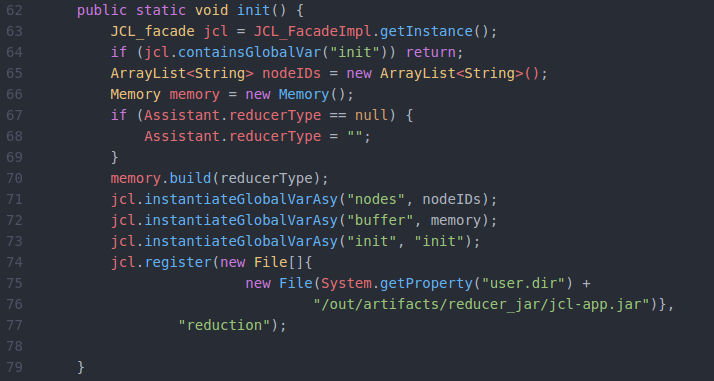

# JCL-APP
What does the sample do?
========================

JCL gateway is an application divided into modules, which implements a sink for a Micaz network, currently, the available modules are receiver, predictor, and reducer. Our differential for most sinks is the implementation of data reduction algorithms and reconstruction scenario algorithms of which are performed in the cloud (JCL Hosts).

**Where can I find the project?**
=================================

On GitHub [here](https://github.com/matheus013/JCL-APP).

How do I run it?
================

You must first start a JCL cluster, having a _Crossbow MPR2600_ along with a micaz network. You should then import the JCL Gateway project. Generate .jar for the following classes: _laccan.main.InitApp_, _laccan.main.PreditorApp_, and _laccan.main.ReducerApp_; remembering to change the path in line 76 in the _laccan.devices.helper.utils.Assistent_ class, before generating .jar from InitApp. All done should connect _Crossbow MPR2600_  and give permission, in case of Ubuntu using the command `sudo chmod -x /dev/ttyUSB1` and then run _laccan.main.ReceiverApp_.

 

How do I use it?
================

This application can be used at several levels, from the implementation of new modules to experimenting with the existing modules. For implementation of new modules, I have a suggestion of a persistence module and a redundancy module, where persistence module would be responsible for storing data in a database, while the redundancy module would avoid problems in case the sink loses connection to the network.

The receiver only provides communication between the micaz and jcl networks. 

The reducer, as requested for best use of the JCL, application responsibility reduction algorithm now, belongs to the HOSTs, so any application connected to the network can call reduction algorithm through the line of code 33 as can be seen in the figure below.

The predictor is with a simple implementation yet, but through the abstract class shown in the figure below, it is easy to implement new prediction techniques. The current implementation only differentiates indoor and outdoor forecasting, returning an expected temperature in or out of LACCAN's rooms.

Questions or comments, where can I go?
======================================

Questions about the API or about codes of this application? See our Programming Guide and Installation Guide.

If you have any questions, please contact the JCL team.
